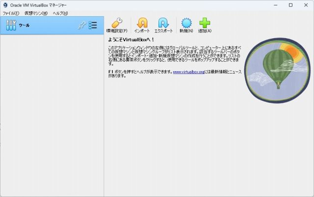
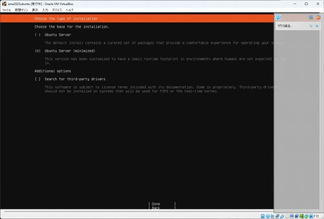
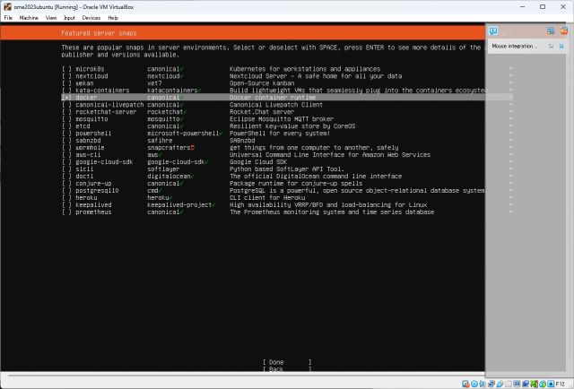
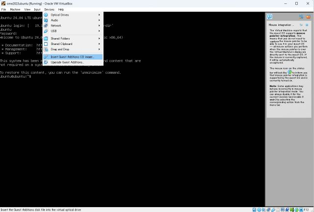

# Build the Distribution ISO in Oracle VirtualBox
This project originally supposes a filesystem of a native Linux to make an ISO file.
Windows users, on the other hands, are able to make the ISO file using their virtualization technologies.
Followings describes instructions on virtual machines or WSL over a Windows system.

## Oracle VM VirtualBox
### General Procedure
- Install Oracle VM VirtualBox
- Install Ubuntu
- Install Docker on the Ubuntu
- Run a build script on the container

### Prerequisites
We confirmed the build operation with the below composition.

- Windows 11 23H2 with Hyper-V enabled
- Oracle VM VirtualBox 7.0.18

### Preparation of VM instance
Download ubuntu server from https://ubuntu.com/server

Open VirtualBox and Press "New".

Put an appropriate name and a destination folder. Fill the "ISO Image" field by the path of what you downloaded now.

You will see a window asking a language in "Preview" section after a while. Press "Show" and follow instructions.
Select "Ubuntu Server (minimized)" for "Choose the type of installation."

Put a check on docker at "Featured server snaps" section.

After the installer prompts you to reboot, log in to the Ubuntu.

Install vm guest tools to share files betweeen the host and the guest. Press "Devices" --> "Insert Guest Additions CD image...".

#### generate ssh key

## WSL
TBD. See https://github.com/OmeSatoFoundation/ome2023/issues/97
